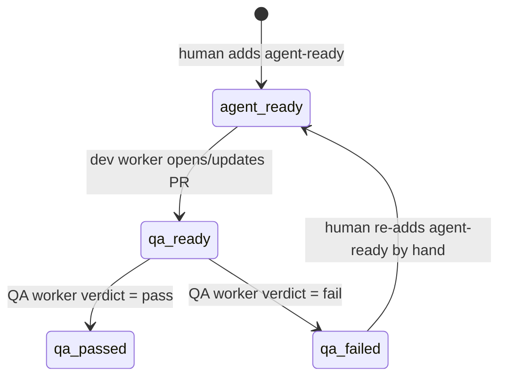

# QA agent flow

## Overview

Add a second poller/worker pair, `github-qa-poller` / `github-qa-worker`,
that mirrors the existing `github-ticket-poller` / `github-ticket-worker`
pattern but runs QA instead of implementation:

- Polls open GitHub issues labeled `agent-qa-ready` (cron-triggered, one
  copy per repo, same as `workflow-github-ticket-poller-weird-reader.yaml`).
- For each, finds the open PR on `agent/issue-<N>` (opened by the existing
  dev flow) and checks out that PR's head branch.
- Runs `scripts/agent-setup.sh` if present (same per-repo convention the dev
  worker already uses) to make the checkout ready.
- Hands off to a coding agent (codex or pi, same `agent-pi`/`agent-codex`
  label routing the dev poller already does) with the issue body/comments as
  instructions and QA-specific prompts: start the app (npm dev, a Go
  binary, etc. — the agent decides how, based on what it finds in the repo),
  run e2e tests if the repo has them, watch server/test logs, and drive the
  running app with the `agent-browser` skill — screenshots are mandatory
  whenever the target is a web app.
- Posts a single issue comment with the verdict and screenshots, removes
  `agent-qa-ready`, adds `agent-qa-passed` or `agent-qa-failed`.

Runs in its own heavy Docker image (`worker/qa/Dockerfile`) with Chrome and
`agent-browser` preinstalled, its own `pool:qa` worker label, and its own
`command/shell` model — the existing coding-worker image stays untouched and
un-bloated. The poller itself needs no browser; it runs unlabeled on the
orchestrator like `github-ticket-poller` already does.

## Context (from discovery)

- Existing pattern to mirror: `workflows/workflow-github-ticket-poller-weird-reader.yaml`,
  `workflows/workflow-github-ticket-worker.yaml`, `scripts/github-ticket-poller.sh`,
  `scripts/github-ticket-worker.sh`.
- Codex/pi routing convention (reused as-is): `agent-pi` / `agent-codex`
  issue labels override the workflow's `ralphex_config` default; `agent-pi`
  wins if both are present (`AGENTS.md` "poller routes each issue" section,
  implemented in `github-ticket-poller.sh`'s `case ",$issue_labels," in`
  block).
- Per-repo setup convention (reused as-is): `scripts/agent-setup.sh`,
  documented in `AGENTS.md` "Repo setup script" — no file means no-op.
- `worker/Dockerfile` builds both `orchestrator` and `coding-worker` in
  `docker-compose.yml` from the same image; the poller step runs unlabeled
  (no `pool:` placement) so it executes inside whichever container hosts
  `swamp serve`, not on a `pool:coding`-labeled worker. The QA poller step
  follows the same shape.
- Owner GitHub tokens (`GH_TOKEN_<OWNER>`), the "no server flag on
  `swamp workflow run`" gotcha, the in-flight-run/stale-run guard, and the
  poller's own separate `command/shell` model (to avoid the two-role lock
  deadlock) all apply identically here — see `AGENTS.md`'s poller/worker
  section, which is the authoritative reference for the trigger-side plumbing.
- Repo test convention for `scripts/`: small bash scripts under `tests/`
  using `set -Eeuo pipefail` + plain `[[ ]]` assertions against a temp
  directory (see `tests/cleanup-run-artifacts.sh`) — no test framework.
  This plan follows the same style for new scripts.

## Development Approach

- **testing approach**: regular (script first, then a `tests/*.sh`
  assertion script per new script), matching the existing convention —
  not TDD, no framework.
- Complete each task fully, run its tests, before moving to the next.
- No workflow YAML or model YAML hand-written from scratch — draft the
  files here for review, then create them for real via
  `swamp workflow create` / `swamp model create` per `CLAUDE.md` rule 9,
  and treat the checked-in YAML as that command's output.
- Match `github-ticket-worker.sh`/`github-ticket-poller.sh` style exactly:
  `fail()` helper, `cleanup()` EXIT trap, required/optional env var
  declarations up top, explicit input validation.

## Testing Strategy

- Unit-level: one `tests/*.sh` per new script, run directly with bash
  against a temp dir/fake `gh`/`jq` output, same shape as the existing
  `tests/` scripts.
- No project-wide e2e test suite exists in this repo (hermestrator itself
  has no UI) — the "e2e tests" in scope are the *target* repos' own, run by
  the QA agent at runtime, not tested here.
- Manual/integration verification is listed under Post-Completion since it
  needs a real repo, real GitHub labels, and a built Docker image.

## Progress Tracking

- Mark completed items with `[x]` immediately when done.
- Add newly discovered tasks with ➕.
- Document blockers with ⚠️.

## Solution Overview

Two new workflows, two new scripts, one new Dockerfile + compose service,
one new pair of `command/shell` models, plus doc updates — no changes to
the existing dev-flow files. Label/state machine on the issue:

`qa_failed → agent_ready` is a **manual** step: a human reviews the QA
failure comment and re-adds `agent-ready` themselves. Nothing in this plan
automates that transition — the dev worker's existing trigger is gated on
`agent-ready` being present (`REQUIRE_AGENT_READY`), so there is no
automatic re-entry loop here, only the two automatic transitions
(`agent_ready → qa_ready`, `qa_ready → qa_passed`/`qa_failed`).

Open design point folded into Task 1: exactly which event removes
`agent-ready` and adds `agent-qa-ready` (today `github-ticket-worker.sh`
already removes `agent-ready` after archiving its plan — see `AGENTS.md`
"After a successful run" bullet). Simplest option, used below: the dev
worker adds `agent-qa-ready` itself right after it opens/updates the PR.
`scripts/github-ticket-worker.sh` currently does `gh issue edit
--remove-label agent-ready` at **three** separate call sites (reuse an
existing open PR, reuse a concurrently-created PR, after creating a new
PR) — Task 1 must cover all three or the PR-reuse paths (the common re-run
case) would never enter the QA queue. Factor the duplicated
`gh issue edit --remove-label agent-ready` into one helper function first,
then extend that helper to also add `agent-qa-ready` — smaller diff than
touching three call sites, and removes the risk of a future edit missing
one. This needs a small, additive change to an existing dev-flow file;
flag it for confirmation before implementing.

## Technical Details

### `agent-qa-ready` state and label additions

- `agent-qa-ready`: issue has a PR ready for QA.
- `agent-qa-passed` / `agent-qa-failed`: terminal QA verdict, mutually
  exclusive — the QA worker always removes whichever of the two it's not
  adding before adding the new one, covering both the fail→retry and the
  pass→re-run-somehow cases the same way, not just fail→retry.

### `scripts/github-qa-poller.sh`

Same shape as `github-ticket-poller.sh` minus the plan/branch-existence
check (QA doesn't care about `docs/plans/`, it cares about a PR existing):

1. Validate `REPO`, resolve `GH_TOKEN_<OWNER>`.
2. `gh issue list --label agent-qa-ready --state open --json number,labels`.
3. Per issue: resolve `agent-pi`/`agent-codex` → `ralphex_config`, same
   `case` block as the dev poller.
4. `gh pr list --head agent/issue-<N> --state open` — no open PR means skip
   with a log line (the label was added without a PR, or the PR already
   merged/closed; don't guess).
5. In-flight-run guard: reuse the same `swamp workflow history search`
   pattern, scoped to `workflowName == "github-qa-worker"`.
6. `setsid swamp workflow run github-qa-worker --input repo=... --input
   issue_number=... --input ralphex_config=... ; disown` — same detach
   rationale as the dev poller.

### `scripts/github-qa-worker.sh`

1. Validate `REPO`, `ISSUE_NUMBER`; resolve `GH_TOKEN_<OWNER>`.
2. `gh pr list --head agent/issue-<N> --state open --json number,headRefName`
   — fail loudly if none (poller already checked, but the worker re-checks:
   never trust poller-to-worker state across the trigger boundary, mirrors
   `REQUIRE_AGENT_READY` in the dev worker).
3. Read the PR's current `headRefOid` (head SHA) right before checkout and
   hold onto it — this is what the verdict comment reports against, so a
   push landing between label-add and checkout doesn't produce a verdict
   silently attributed to the wrong commit.
4. Clone the repo into a fresh `/tmp` workspace, checkout that pinned SHA
   (not just the branch tip).
5. Run `scripts/agent-setup.sh` if present, exactly like the dev worker.
   Note: `agent-setup.sh`'s documented contract (`AGENTS.md`) is "ready for
   lint/test/typecheck/build," not "app is runnable" — it may leave the
   checkout without a database, seed data, or other runtime dependencies
   the app needs to actually start. Out of scope to fix generically here;
   the QA prompt (Task 5) must treat "app won't start" as a normal, expected
   verdict outcome, not a worker-script error.
6. Run the QA agent (codex or pi, per `RALPHEX_CONFIG`) under one overall
   wall-clock timeout for the whole QA pass (start app + test + browse +
   verdict) — mirrors ralphex's own run timeout in the dev worker. How the
   agent starts the app, decides it's ready, and what it tries are entirely
   its own call (per QA prompt, Task 5); the worker only enforces the outer
   timeout and kills the process tree on expiry, reporting verdict=fail
   "QA run timed out" rather than leaving a hung worker.
7. Parse the agent's verdict from a fixed-format last line (see Task 5 for
   the exact contract) + collect screenshot paths.
8. Build one issue comment (`gh issue comment`) stating the verdict and the
   checked-out SHA, with screenshots embedded as markdown images — see
   "Screenshot attachment mechanism" below for how they get a stable URL.
9. Swap `agent-qa-ready` → `agent-qa-passed`/`agent-qa-failed` via
   `gh issue edit --add-label --remove-label`.

### Verdict line contract (shared between Task 3 and Task 5)

The worker script (Task 3, parses) and the QA prompt (Task 5, emits) are
built as separate tasks against the same interface — pin it here so they
don't drift:

- Last non-empty line of agent output matches `QA_VERDICT: PASS` or
  `QA_VERDICT: FAIL: <one-line reason>`.
- Screenshot paths are written by the agent under a fixed, worker-provided
  directory (e.g. `$RUN_ARTIFACTS_DIR/<run-id>/screenshots/`), not parsed
  out of prose — the worker globs that directory after the agent exits.
- A missing/unparseable verdict line is itself a fail
  (`QA_VERDICT: FAIL: no verdict emitted`), never silently treated as pass.

### QA agent invocation: direct, not through ralphex

The `ralphex_config`/`RALPHEX_CONFIG` name is kept as-is through the QA
poller/worker/labels (`agent-pi`/`agent-codex` routing, `ralphex-codex`/
`ralphex-pi` enum values) purely to reuse the same shared vocabulary as the
dev flow — for QA it's read only as "codex vs pi," not as a ralphex config
directory selector. Not worth a rename for one flow when it'd fork the
label/enum convention from the other.

ralphex is a diff-oriented, plan/implement/review tool: its task phase
expects to produce commits, and even `--review` requires committed changes
on a branch to `git diff` against (confirmed against its own docs — no
mode fits "observe runtime behavior, make no code changes, emit a
verdict"). QA does not use ralphex at all. Instead the worker invokes the
selected agent directly, non-interactively, with the QA prompt as its
initial instruction:

- codex: `codex exec "$(cat "$prompt_file")"`
- pi: `pi --print "$(cat "$prompt_file")"` (`--print`/`-p` = non-interactive,
  process prompt and exit)

Both give the agent shell/bash tool access in the checkout, which is enough
to start the app, run e2e tests, and drive `agent-browser` via its CLI —
no MCP wiring beyond what `agent-browser`'s own skill/CLI already needs.

QA does not reuse the `ralphex-codex`/`ralphex-pi` config directories
(those hold ralphex-specific executor/model settings for a tool QA doesn't
run) or `worker/ralphex-common/prompts/` (those are implement/review-phase
prompts for a build workflow). It gets its own minimal config: model
choice per agent (picked in Task 5/6, no strong reason to differ from the
dev-flow's own choices, but not literally parsed from the ralphex config
format), and the same runtime auth env vars already provisioned for the
dev flow (`CODEX_ACCESS_TOKEN`/`OPENAI_API_KEY` for codex,
`OPENCODE_API_KEY` for pi — see `docs/remote-worker.md`'s existing table).

### QA agent prompts

New prompt directory, `worker/qa/prompts/` — one prompt per agent or one
shared prompt text passed to both (decide in Task 5 based on how much the
codex/pi invocations actually need to differ) — not reusing the dev-flow's
`worker/ralphex-common/prompts/`, which are ralphex phase prompts for a
tool QA doesn't run.

### `worker/Dockerfile`: multi-stage, `qa` target instead of a second file

Not a separate `worker/qa/Dockerfile` — Docker can't `FROM` a stage defined
in a *different* Dockerfile without first building and publishing it as its
own image (extra build step, extra thing to keep in sync for local
Compose builds). Simpler and just as effective: turn `worker/Dockerfile`
into one multi-stage file with a shared `base` stage and two final
targets, `dev` (today's `coding-worker`/`orchestrator` image, unchanged
behavior) and `qa`. `docker-compose.yml` picks the target per service via
`build.target`; both still build from the same `dockerfile:
worker/Dockerfile`.

Since QA invokes codex/pi directly (previous section) rather than through
ralphex, the `qa` target needs a smaller slice of tooling than a first pass
would assume:

- **`base` stage** (shared): `swamp` (worker connect), `gh`, `jq`, `git`,
  `mise` (still needed for `scripts/agent-setup.sh` to resolve the target
  repo's own toolchain), `codex`, `pi`, the `worker` user/home dirs, the
  entrypoint script.
- **`dev` target only**: `ralphex`, `gremlins`, and the
  `ralphex-codex`/`ralphex-pi`/`ralphex-common` config/prompt directories —
  all ralphex-specific, unused by `qa`.
- **`qa` target only**: Debian's `chromium` apt package (not
  `agent-browser install`'s Chrome for Testing download — that ships
  amd64-only and hard-fails on arm64; verified by actually building both
  archs), `agent-browser` npm package with its platform binary chmodded by
  hand (`--ignore-scripts`, like codex/pi, skips its postinstall),
  `worker/qa/prompts/`, and an `agent-browser.json` config
  (`AGENT_BROWSER_CONFIG`) pointing `executablePath` at
  `/usr/bin/chromium` — confirmed working by running `agent-browser open`
  + `screenshot` inside the built image, not just inferred from docs.

`AGENTS.md` requires every version bump in `worker/Dockerfile` to update
its pinned SHA-256 checksum in the same change — putting the tools both
targets actually share in `base` means a shared-tool bump happens once,
not twice with nothing to catch a missed copy.

### Screenshot attachment mechanism

No `agent-browser` skill convention exists for this (checked: the
`dogfood`/QA skill writes screenshots to local disk only, no GitHub
integration). GitHub has no public, stable API for the drag-and-drop
image upload the web UI uses — that's an internal, session-authenticated
endpoint, not usable from a PAT-authenticated `gh`/API call. Avoid it and
any new external image host (matches the "no new external image host"
constraint already in Technical Details).

Mechanism: commit each run's screenshots to a dedicated, long-lived branch
in the *same* repo (`qa-screenshots`, created if it doesn't exist) under
`<issue_number>/<workflow_run_id>/<file>.png`, push, then embed each image
in the verdict comment as a standard markdown image referencing
`https://raw.githubusercontent.com/<owner>/<repo>/<commit-sha>/<path>` —
pinned to the commit SHA (not the branch name) so the link can't go stale
if a later run's commit moves the branch tip. This needs no new
infrastructure: git/gh access the worker already has, GitHub already
renders `raw.githubusercontent.com` image URLs inline in comments.

Accepted trade-off, not solved here: `qa-screenshots` grows forever (every
run adds blobs, nothing prunes it). Fine for v1; add a retention job only
if branch/repo size actually becomes a problem (`ponytail:` — no premature
cleanup logic).

### Worker lifecycle: ephemeral, not persistent

Unlike `coding-worker` (always-on daemon, `restart: on-failure`), the QA
image is heavy (Chrome + agent tooling) and only needs to exist while
there's QA work queued — it should start on a schedule, drain pending
`pool:qa` work, and exit, not sit resident between runs. `swamp worker
connect` supports this directly:

- `--max-dispatches N` / `SWAMP_WORKER_MAX_DISPATCHES`: drain and exit 0
  after N dispatches complete.
- `--idle-timeout` / `SWAMP_WORKER_IDLE_TIMEOUT`: drain and exit 0 after
  being continuously idle for a duration (e.g. `2m`).

The QA poller still triggers `swamp workflow run github-qa-worker` with
`pool: qa` placement exactly as today; if no `pool:qa` worker is connected
at trigger time, the run simply queues at the orchestrator until one
connects — no change needed to the poller/trigger design for this.

#### `docker-compose.yml`

New `qa-worker` service, same shape as `coding-worker` but:
- `dockerfile: worker/qa/Dockerfile`
- `SWAMP_WORKER_LABELS: pool=qa`
- `SWAMP_WORKER_IDLE_TIMEOUT: 2m` (or `--max-dispatches 1`), no `restart:`
  — it's meant to exit, not be restarted into a loop
- own named volumes for `.swamp-worker`/`.codex`/`.pi` state (don't share
  the coding-worker's, to keep enrollment tokens and any cached
  agent-browser/Chrome profile state separate)
- invoked via `docker compose run --rm qa-worker` (from a host cron entry
  for local/Compose deployments), not `docker compose up -d`

#### k3s: documentation only, not applied by this plan

The user's actual deployment runs on k3s, not this repo's `docker-compose.yml`
(that file is the local-dev/reference deployment only — no k8s manifests
exist anywhere in this repo, and the orchestrator's own k3s deployment is
already managed outside it). This plan documents an example `CronJob`
manifest in `docs/remote-worker.md` — image, env vars, `SWAMP_WORKER_IDLE_TIMEOUT`,
`restartPolicy: Never`, `concurrencyPolicy: Forbid` (a second concurrent
CronJob run would double-enroll workers pointlessly, since each run should
just drain whatever's queued and exit) — as a reference the user adapts and
applies to their own cluster; actually applying it is out of scope (Post-
Completion), same as provisioning `pool:qa` enrollment tokens already was.

## What Goes Where

Implementation steps below are all achievable inside this repo. Post-
Completion covers what needs a live deployment (real Docker build, real
GitHub labels/tokens, real target repo) to verify end-to-end.

## Implementation Steps

### Task 1: Trigger — dev worker adds `agent-qa-ready` on PR open/update

**Files:**
- Modify: `scripts/github-ticket-worker.sh`
- Create: `tests/github-ticket-worker-labels.sh`

- [x] confirm with user before implementing (flagged in Solution Overview —
      this is the one task touching an existing dev-flow file)
- [x] factor the three existing `gh issue edit --remove-label agent-ready`
      call sites (reuse-existing-PR, reuse-concurrent-PR, new-PR — lines
      280, 292, 299 in the current file) into one helper function
      (`mark_ready_for_qa`)
- [x] extend that helper to also `--add-label agent-qa-ready`, and to
      `--remove-label agent-qa-failed` if present (closes the stale-verdict
      window noted in Technical Details)
- [x] handle the case where `agent-qa-ready` is already present (re-run
      after a QA fail/re-fix cycle) — `gh issue edit --add-label` is
      idempotent, no extra guard needed
- [x] write a test asserting the helper is called from all three call
      sites and performs all label operations together
      (`tests/github-ticket-worker-labels.sh`)
- [x] run tests — must pass before task 2 (pre-existing, unrelated failure
      in `tests/vault-write-note-artifacts.sh` confirmed present before
      this change too, via `git stash`)

### Task 2: `scripts/github-qa-poller.sh`

**Files:**
- Create: `scripts/github-qa-poller.sh`
- Create: `tests/github-qa-poller.sh`

- [x] implement per Technical Details above, matching
      `scripts/github-ticket-poller.sh` style exactly (that script itself
      has no `fail()`/`cleanup()` trap — those are `github-ticket-worker.sh`
      conventions; the poller uses inline `{ printf ...; exit 1; }`)
- [x] `agent-pi`/`agent-codex` → `ralphex_config` routing, copied logic
- [x] open-PR-on-`agent/issue-<N>` lookup and skip-if-none handling
- [x] in-flight-run guard scoped to `workflowName == "github-qa-worker"`
- [x] detached `swamp workflow run github-qa-worker` trigger
- [x] write tests: no issues, issue with no PR (skip), issue with PR and no
      active run (triggers), issue with an active non-stale run (skip),
      label routing (agent-pi/agent-codex/neither)
- [x] run tests — must pass before task 3

### Task 3: `scripts/github-qa-worker.sh`

**Files:**
- Create: `scripts/github-qa-worker.sh`
- Create: `tests/github-qa-worker.sh`

- [x] implement per Technical Details above: validate inputs, resolve
      owner token, find PR head ref, pin its head SHA, clone+checkout that
      SHA, run `scripts/agent-setup.sh` if present
- [x] invoke the QA agent directly per `RALPHEX_CONFIG`
      (`codex exec`/`pi --print`, not ralphex — see Technical Details) with
      the QA prompt profile from Task 5 and the issue body/comments as
      context, under one overall wall-clock timeout (`timeout
      --kill-after=10s`); report `QA_VERDICT: FAIL: QA run timed out` on
      expiry
- [x] parse the agent's verdict per the Verdict line contract (Technical
      Details) — unparseable/missing output is a fail, never a silent pass
      — and glob the fixed screenshots directory
- [x] post the issue comment (verdict + pinned SHA + screenshots) —
      resolve the screenshot-attachment mechanism (see Technical Details,
      finalized together with Task 4 since they're the same code path)
- [x] swap `agent-qa-ready` → `agent-qa-passed`/`agent-qa-failed`
- [x] write tests: missing PR (fails loudly), label swap on pass, label
      swap on fail, missing `agent-setup.sh` is a no-op not a failure
      (implicit: fixture repo has none, both scenarios still succeed),
      missing/garbage verdict line is treated as fail (unit-tested via
      `parse_verdict` directly)
- [x] run tests — must pass before task 4

### Task 4: Resolve screenshot-attachment mechanism

**Files:**
- Modify: `scripts/github-qa-worker.sh` (finalize the placeholder from
  Task 3)

- [x] implement the `qa-screenshots` branch push + SHA-pinned
      `raw.githubusercontent.com` markdown image embedding per Technical
      Details' "Screenshot attachment mechanism" (`publish_screenshots`
      in `github-qa-worker.sh`, done as part of Task 3 — same code path)
- [x] handle the branch-doesn't-exist-yet case (first-ever QA run on a
      repo): create it as an empty/orphan branch rather than failing
- [x] write a test asserting the comment body contains
      `raw.githubusercontent.com` URLs pinned to a commit SHA, not local
      file paths or the mutable branch name
- [x] run tests — must pass before task 5

### Task 5: QA prompt profile (`worker/qa/prompts/`)

**Files:**
- Create: `worker/qa/prompts/task.txt`

- [x] write the QA task prompt: read issue instructions, start the app
      (agent decides npm dev vs a built binary vs whatever the repo's
      `agent-setup.sh`/README documents, including how it decides the app
      is ready — no port-polling helper from the worker script, this is
      entirely the agent's call), run e2e tests if present, use
      `agent-browser` to exercise the golden path + edges, screenshots
      mandatory for web targets — written to the fixed screenshots
      directory from the Verdict line contract
- [x] instruct the agent to emit the exact `QA_VERDICT: PASS` /
      `QA_VERDICT: FAIL: <reason>` line per the Verdict line contract,
      including treating "app wouldn't start" as a normal fail reason, not
      a crash
- [x] no unrelated reviewer/multi-phase machinery from the dev-flow
      prompts — QA is a single pass, not a plan/implement/review loop
- ➕ dropped the planned per-agent model-choice config file: `codex
      exec`/`pi --print` both pick up model/auth from the same runtime env
      vars already provisioned for the dev flow (Technical Details), so
      there's nothing left for a separate config file to override — add
      one only if a real need for a QA-specific model choice shows up
- [ ] smoke-test the prompt manually against one real ticket once Task 6's
      image exists (tracked in Post-Completion, not a checkbox here)

### Task 6: `worker/Dockerfile` multi-stage `qa` target

**Files:**
- Modify: `worker/Dockerfile` (split into `base`/`dev`/`qa` stages —
  existing `dev` behavior must not change)
- Create: `worker/qa/prompts/` copied in by the `qa` stage (already
  written in Task 5)
- Modify: `docker-compose.yml`
- Modify: `docs/remote-worker.md`

- [x] restructure `worker/Dockerfile` into `FROM ... AS base` (apt
      packages, mise, swamp, gh, codex, pi, worker user/home dirs,
      entrypoint) → `FROM base AS dev` (today's ralphex/gremlins/
      ralphex-config installs, unchanged) → `FROM base AS qa` (chromium +
      `agent-browser` + `worker/qa/prompts/`)
- [x] verify `docker build --target dev .` still produces a working image
      equivalent to today's (built it; confirmed codex/pi/gh/swamp/mise/
      ralphex/gremlins all present and ralphex-codex/ralphex-pi config
      dirs intact)
- [x] add `qa-worker` service to `docker-compose.yml`: `dockerfile:
      worker/Dockerfile`, `target: qa`, own volumes, same GH token env vars
      as `coding-worker`, `SWAMP_WORKER_IDLE_TIMEOUT: 2m`, no `restart:`
      (pool label comes from the image's own `ENV SWAMP_WORKER_LABELS`
      now, not repeated in compose — see "Worker lifecycle: ephemeral, not
      persistent"; this service is run via `docker compose run --rm`, not
      left `up -d`); `docker compose config` validated clean
- [x] set `target: dev` explicitly on the existing `orchestrator`/
      `coding-worker` services (was implicit/only target before); also
      dropped the now-redundant `SWAMP_WORKER_LABELS: pool=coding` from
      `coding-worker`'s environment since the `dev` stage's own `ENV` sets
      it
- [x] document the new target/service in `docs/remote-worker.md`: a "QA
      ticket worker" section (same detail level as "Image contents"/
      "Runtime configuration") plus an "Ephemeral QA worker scheduling"
      subsection with the Compose `run --rm` + host-cron example and an
      example k3s `CronJob` manifest (`restartPolicy: Never`,
      `concurrencyPolicy: Forbid`, `SWAMP_WORKER_IDLE_TIMEOUT` set) as a
      reference the user adapts to their own cluster — this repo doesn't
      apply it
- [x] `docker build --target qa -f worker/Dockerfile .` succeeds locally
      (both `linux/arm64`, tested directly, and via the amd64 code path
      reviewed — same package, no per-arch chromium special-casing needed)
      — went further than "build succeeds": ran `agent-browser open` +
      `screenshot` as the `worker` user inside the built image and got a
      real PNG back, confirming the config-file `executablePath` approach
      actually works, not just that it plausibly should
- ➕ found and fixed two regressions the "just build it" check wouldn't
      have caught on its own: (1) `SHELL` doesn't carry across a new
      `FROM` even within the same multi-stage file — `dev`'s two `RUN ...
      | sha256sum --check -` steps silently lost `pipefail` until
      `SHELL [...]` was redeclared in the `dev` stage (hadolint caught it,
      `DL4006`); (2) `.github/workflows/build-and-push.yml` built `file:
      worker/Dockerfile` with no `--target`, which now defaults to the
      *last* stage (`qa`) instead of the intended `dev` — turned the whole
      job into a matrix over `[dev, qa]`, each with its own tag prefix
      (`""`/`qa-`) and validate step; confirmed both builds and both
      validate commands actually pass locally, not just that the YAML
      parses

### Task 7: Workflows and models — `workflow-github-qa-poller.yaml`, `workflow-github-qa-worker.yaml`

**Deviation from the dev-flow's per-repo pattern, by explicit request**: the
dev flow copies a whole near-identical workflow file per polled repo
(`workflow-github-ticket-poller-<repo>.yaml` × 3 — files-nest, streamberg,
weird-reader). For QA, the user asked for one common settings place instead
of three more near-duplicate files. `scripts/github-qa-poller.sh` takes a
`REPOS` list (comma/whitespace-separated `owner/name` entries) and loops
the existing per-repo logic; `workflow-github-qa-poller.yaml` is one
workflow with its own `trigger.schedule`, defaulting `repos` to today's
three dev-flow repos — no per-repo file copies for QA.

**Files:**
- Modify: `scripts/github-qa-poller.sh` (Task 2's `REPO` → `REPOS`, loop
  per repo, continue past one repo's failure rather than aborting the tick)
- Modify: `tests/github-qa-poller.sh` (multi-repo coverage)
- Create: `workflows/workflow-github-qa-poller.yaml` (already scaffolded
  via `swamp workflow create`; single workflow, own `trigger.schedule`,
  `repos` input defaulting to `moontechs/files-nest,moontechs/weird-reader,
  mkoziy/streamberg`)
- Create: `workflows/workflow-github-qa-worker.yaml` (already scaffolded
  and filled in — done)
- Create two new `command/shell` models (`github_qa_poller_shell`,
  `github_qa_worker_shell`) via `swamp model create` — kept separate from
  each other and from the dev-flow models for the same lock-contention
  reason `AGENTS.md` documents for the existing pair — done

- [x] `swamp model create command/shell github_qa_poller_shell` and
      `github_qa_worker_shell`
- [x] `swamp workflow create` + fill in `workflow-github-qa-worker.yaml`:
      single `main` job running `scripts/github-qa-worker.sh` with
      `pool: qa` placement (no vault-sync job — QA doesn't write to the
      notes vault, matches the scope call already flagged in the plan);
      `swamp workflow validate` passed
- [x] rework `scripts/github-qa-poller.sh` to accept `REPOS` (list) instead
      of `REPO` (single), looping today's per-repo body (`poll_repo`
      function); one repo's `gh`/`swamp` failure logs and continues to the
      next repo rather than aborting the whole tick (`overall_status`)
- [x] update `tests/github-qa-poller.sh` for the `REPOS` list — added a
      two-repo scenario where each repo independently triggers/skips per
      its own fixture state, on top of the existing single-repo scenarios
- [x] `swamp workflow create` + fill in `workflow-github-qa-poller.yaml`:
      one `main` job running `scripts/github-qa-poller.sh`, `repos` input
      (`trigger.inputs.repos` = today's three dev-flow repos), own
      `trigger.schedule` (`*/15 * * * *`, matching the dev flow's cadence),
      `label` default `agent-qa-ready`, `ralphex_config`, `server_url` —
      `swamp workflow validate` passed
- [x] run tests — must pass before task 8

### Task 8: Verify acceptance criteria

- [x] verify every item in Overview is implemented: label-driven trigger
      (Task 1/2), PR checkout at a pinned SHA (Task 3), agent-setup.sh
      (Task 3), agent decides run mechanism (Task 5 prompt), e2e run
      (Task 5), log watching (Task 5), agent-browser driving + mandatory
      web screenshots (Task 5), issue comment with verdict (Task 3/4),
      label swap (Task 3), cron-scheduled (Task 7), separate heavy image
      (Task 6), codex/pi split reusing existing label routing (Task 2/3)
      — all present
- [x] run every new `tests/*.sh` script, confirm all pass — all pass;
      `tests/vault-write-note-artifacts.sh` fails, confirmed pre-existing
      and unrelated via `git stash` in Task 1
- [x] no repo-wide lint/test/build gate exists for this infra repo (no
      such command documented in README) — closest equivalent is
      `.github/workflows/build-and-push.yml`'s hadolint + Docker build;
      ran both locally (hadolint clean, `--target dev` and `--target qa`
      both build and their validate commands both pass) to confirm nothing
      in the dev flow regressed

### Task 9: Update documentation

- [x] update `AGENTS.md` with a "QA flow" section parallel to the existing
      poller/worker section — label lifecycle, the `agent-qa-ready` trigger
      point in the dev worker, the separate `pool:qa` image rationale
- [x] update `AGENTS.md`'s "GitHub tokens" owner-onboarding checklist: a
      new owner now needs a `case` arm added to four scripts
      (`github-ticket-poller.sh`, `github-ticket-worker.sh`,
      `github-qa-poller.sh`, `github-qa-worker.sh`), not two
- [x] `README.md` does document the dev flow end-to-end (an ASCII diagram
      in "How it works") — added a matching QA-flow diagram and a
      `worker/` layout-table update
- [x] move this plan to `docs/plans/completed/`

## Post-Completion

**Manual verification:**
- Real end-to-end run against one real repo/issue: add `agent-qa-ready` to
  an issue with an open PR, confirm the QA worker picks it up, starts the
  app, screenshots land in the issue comment, label swaps correctly on both
  a pass and a forced-fail run.
- Confirm Chrome/`agent-browser` actually launches inside the new container
  (headless flags, sandboxing under the unprivileged `worker` user — the
  existing image runs commands via `gosu worker`, Chrome sandboxing under a
  non-root user in a container sometimes needs `--no-sandbox` or extra
  capabilities; verify rather than assume).
- Confirm the in-flight-run guard actually prevents duplicate QA triggers
  under a real 15-minute-tick cron schedule, same as the dev poller's
  documented behavior.
- Check actual memory/CPU footprint of a QA run (headless Chrome + coding
  agent + ralphex in one container) against whatever the real deployment's
  pod limits are; size `pool:qa` concurrency accordingly — not measurable
  until Task 6's image exists.
- Confirm there's no meaningful window where a human pushes a new commit to
  the PR while a QA run is already mid-flight against the previously-pinned
  SHA (accepted risk for v1, same class of gap as the dev-worker's own
  push-progress/retry model — not solved by a lock here, just noted).

**External system updates:**
- Create the `agent-qa-ready`/`agent-qa-passed`/`agent-qa-failed` GitHub
  labels in each target repo before enabling this flow — `gh issue edit
  --add-label`/`--remove-label` require the label to already exist
  repo-wide, same unstated precondition `agent-ready`/`agent-pi`/
  `agent-codex` already have today (nothing in this repo creates any of
  them).
- Each target repo may need its own QA-facing conventions documented
  (e.g. how `agent-setup.sh` should expose "how to start the app" if that
  isn't already obvious from the repo, same spirit as the existing
  `agent-setup.sh` onboarding prompt in `AGENTS.md`) — out of scope for
  this repo, tracked per-repo as needed.
- Provision `pool:qa` worker enrollment tokens and any new secrets
  (Chrome/agent-browser may need none beyond what's already provisioned)
  in the actual deployment's secret manager.
- Apply an actual k3s `CronJob` (adapted from Task 6's documented example)
  to the user's own cluster, pointing at the built `worker/qa/Dockerfile`
  image — this repo only documents the manifest, it doesn't manage or
  apply k8s resources.
